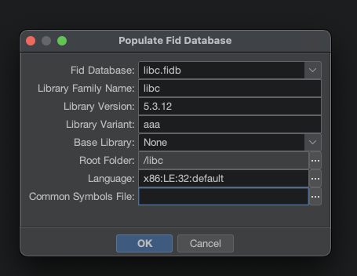

# chapter14_codes


# Creating FidDb

## 1. Create a new directory for the project

```bash
mkdir libc_fidb
```

## 2. Put libc.a in the root directory

```
cp /path/to/libc.a ./libc.a
```

## 3. Run the script to auto-analyze libc.a

```bash
chmod +x ./create_fidb.sh 
./create_fidb.sh
```

## 4. Open Project and create FidDb

1. Open `./libc_fidb/MyLibcFIDB.gpr` in your Ghidra.

1. Open CodeBrowser, and go to `Tools -> Function ID -> Create new empty FidDb...`.

1. Create a new FidDb with the name `libc.fidb`.

1. Go to `Tools -> Function ID -> Populate FidDb from programs...`.

1. Input like this: 



1. Click `OK`, and wait for the process to finish.


